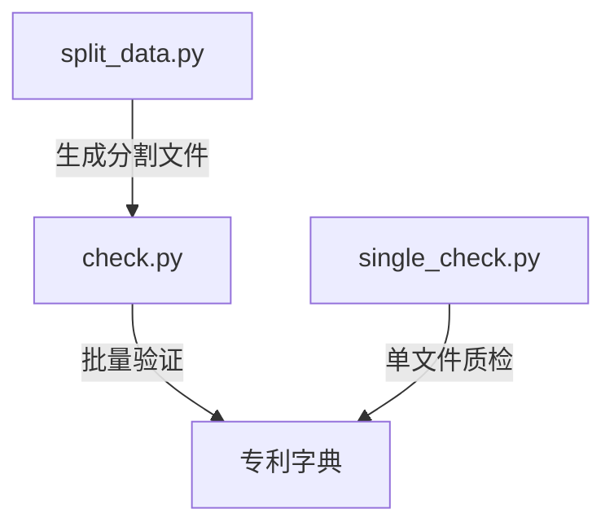
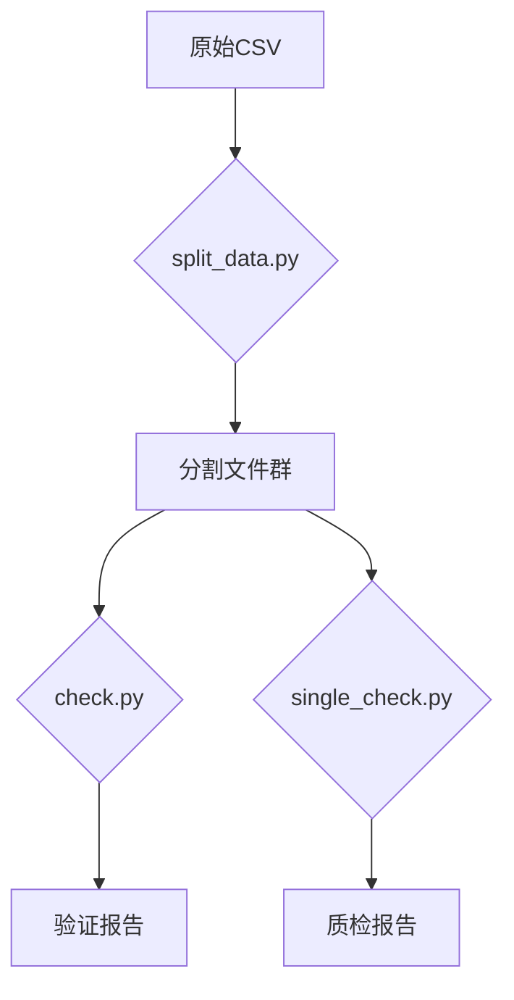
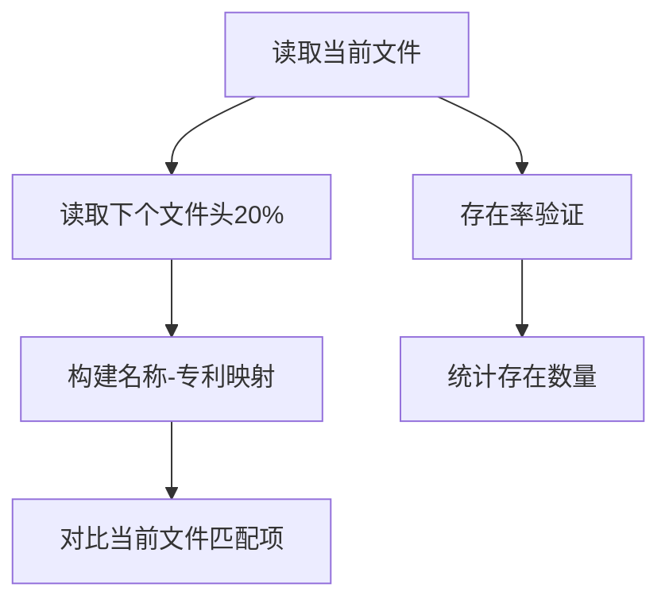

# 开发者文档

## 模块划分

```mermaid
graph TD
    split[split_data.py] --> |生成分割文件| check
    check[check.py] --> |批量验证| auth_dict[专利字典]
    single_check[single_check.py] --> |单文件质检| auth_dict
```

## 整体流程

```mermaid
graph TD
    A[原始CSV] --> B{split_data.py}
    B --> C[分割文件群]
    C --> D{check.py}
    D --> E[验证报告]
    C --> F{single_check.py}
    F --> G[质检报告]
```

## 验证逻辑

```mermaid
graph TD
    A[读取当前文件] --> B[存在率验证]
    A --> C[读取下个文件头20%]
    C --> D[构建名称-专利映射]
    B --> E[统计存在数量]
    D --> F[对比当前文件匹配项]
```

## 检查标准

- "有效名称" : count_now_name
- "专利标注" : count_have_patent_fixed
- "有效专利号" : success_patent_publication_number

